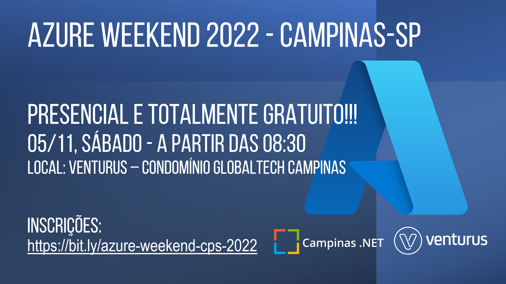

# Azure Weekend 2022 - Campinas-SP
Fotos e informações gerais sobre a edição **Azure Weekend** realizada em **05/11/2022** na cidade de **Campinas-SP**.

Organizadores:
- **Renato Groffe (Microsoft MVP, MTAC)**
- **Ericson da Fonseca (Microsoft MVP)**

Número de participantes: **35 pessoas**

Apresentações que aconteceram durante o evento:
* Keynote - Azure Weekend - Adriano Rodrigues (Microsoft)

* Desenvolvimento na plataforma arm64 com Windows Dev Kit 2023 - Jorge Arteiro (Cloud Advocate - Microsoft)

* IoT, Inteligência Artificial, Serviços Cognitivos e Machine Learning no Microsoft Azure - Jamil Lopes (Microsoft Regional Director, Azure Advisor, Windows Insider MVP)

* Entregando soluções do Power Apps com Azure DevOps - Eleriane Cristina Costa (Microsoft MVP, MTAC)

* Azure Serverless Eficiente - Mateus Barros e Murilo Beltrame (DevPira)

* Azure Container Apps: escalabilidade de aplicações e descomplicando o uso do Kubernetes na nuvem - Ericson da Fonseca (Microsoft MVP) e Renato Groffe (Microsoft MVP, MTAC)

Este evento foi uma parceria entre as comunidades [**Campinas .NET**](https://www.meetup.com/campinasdotnet/), [**.NET SP**](https://www.meetup.com/dotnet-Sao-Paulo/) e [**Azure Talks**](https://www.meetup.com/azure-talks/).

Formulário utilizado para inscrições: [**Sympla**](https://www.sympla.com.br/evento/azure-weekend-2022-campinas-sp-presencial-e-gratuito/1766575)

Local: Auditório da Venturus - Estrada Giuseppina Vianelli di Napolli, 1185 - Polo II de Alta Tecnologia - Campinas - SP - CEP: 13086-530

